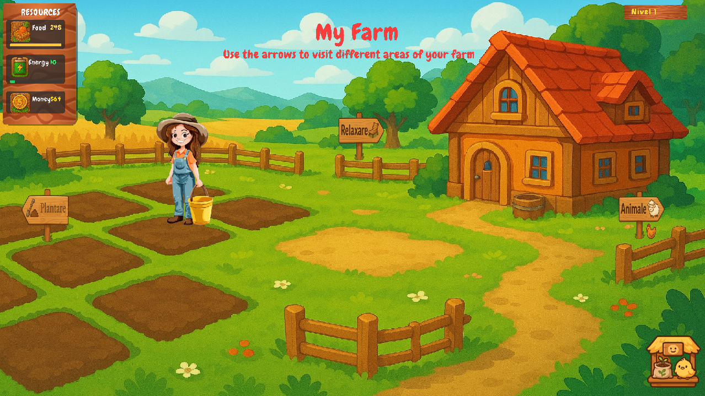
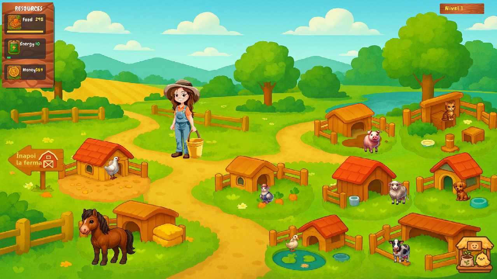
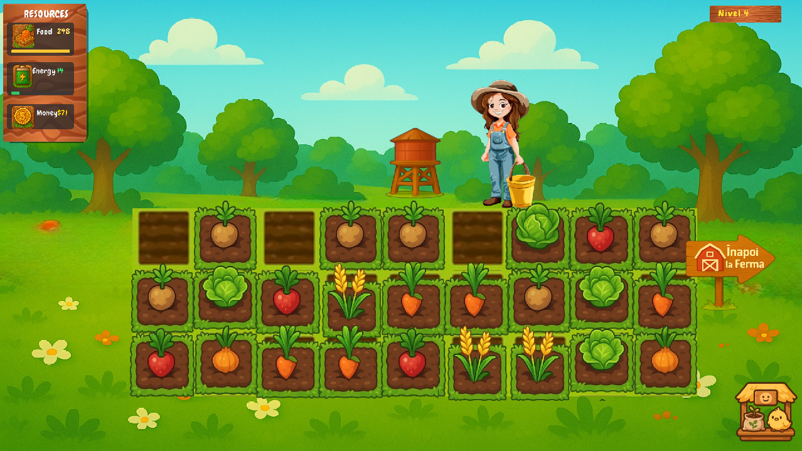
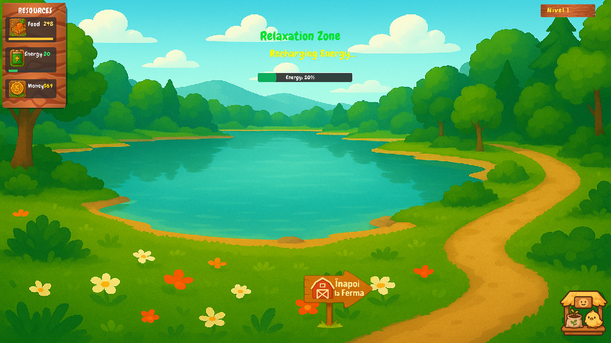

# 🌾 C Farming Simulator — 2D Farming Simulation in C


A modular 2D farming simulation game built from scratch in pure **C** using the **raylib** graphics engine. The game features multiple interactable world zones, custom crop growth timers, dynamic animal care logic, an in-game economy, inventory management, and persistent save data.

---

## 🎮 Gameplay & World Zones

The game environment is divided into 4 functional zones, each with its own gameplay mechanics and progression systems.

### 🏡 Home Zone

The player can access the barn to open the inventory and manage their farming resources.

### 🌿 Rest & Relaxation Zone

The player can visit a peaceful lake area to restore energy required for daily farming activities.

### 🌱 Crop Farming Zone

The player can purchase and plant crops using in-game currency.

After planting, each crop takes a certain amount of time to grow and produces a randomly selected plant.

Once the crop is ready, the player must collect it to receive money.

The player can interact with the **Water Tower** to water the crop and accelerate its growth.

If a fully grown crop is not collected within the required time, it disappears and the player receives no money from that crop.

This creates a simple risk/reward system where the player must manage both time and resources.

### 🐔 Livestock Zone

The player can purchase and care for farm animals by providing them with food.

After being fed, chickens and ducks can produce eggs that the player must collect.

Animals also have a limited lifespan. When an animal becomes old, the player can sell it and receive money.

After an animal is sold, a new animal can eventually appear in its place, allowing the livestock system to continue throughout the game.

### 🛒 In-Game Shop

The shop is used to purchase resources required for farm progression, including:

* Animal food
* Water refills

Money earned from crops, eggs, and livestock sales can be spent on further farm activities.

---

## 📸 Gameplay Screenshots

The following screenshots showcase the main gameplay areas and interactive systems of the farming simulation.

### 🌍 Main World Overview



### 🐔 Livestock Zone



### 🌱 Crop Farming Zone



### 🏡 Home & Rest Zone



## 🛠️ Technical Highlights & Architecture

* **Pure C Memory & State Management:** Game states, inventory limits, and energy loops are implemented using C data structures and explicit state management.
* **Modular Codebase:** Clean separation between core execution (`main.c`), game logic (`game.c`), and rendering (`render.c`).
* **Cross-Platform Support:** The game can be built and run on both **Windows and Linux**.
* **Fullscreen Mode:** The game starts directly in fullscreen mode using the monitor's available resolution.
* **Persistent Game State:** Player progress, money, energy, food stock, pens, and plots can be saved and restored using a local save file.
* **raylib Graphics:** Rendering, textures, input handling, audio, and window management are implemented using raylib.

---

## 📂 Project Structure

```text
.
├── assets/        # Sprites, textures, fonts, icons, UI assets
├── include/       # Header files
├── lib/           # Bundled raylib libraries for Windows/MinGW
├── src/           # Game logic and rendering
├── .gitignore
├── Makefile       # Cross-platform build configuration
└── README.md
```

---

# 🚀 Building & Running

## 🪟 Windows

### Prerequisites

* GCC / MinGW
* `make`
* raylib libraries included in the `lib/` directory

The Windows build uses the raylib libraries bundled with the project.

### Clone the project

Open Git Bash or PowerShell and run:

```bash
git clone https://github.com/bianca-andreica/c-farming-simulator.git
```

Enter the project directory:

```bash
cd c-farming-simulator
```

### Build

From the project root:

```bash
make
```

### Run

```bash
./farming_game.exe
```

### Manual GCC Compilation

If you want to compile the game manually:

```bash
gcc -Wall -std=c99 -Iinclude src/main.c src/game.c src/render.c -o farming_game.exe -Llib -lraylib -lopengl32 -lgdi32 -lwinmm
```

---

## 🐧 Linux

### Prerequisites

Linux requires a local installation of raylib because the raylib library bundled in `lib/` was built for Windows/MinGW and cannot be linked directly with Linux GCC.

These instructions are intended for Ubuntu/Debian-based systems.

### 1. Install the required development tools

Update the package lists:

```bash
sudo apt update
```

Install the compiler, build tools, `pkg-config`, Git, CMake, and the libraries required to build raylib:

```bash
sudo apt install build-essential pkgconf git cmake libgl1-mesa-dev libx11-dev libxrandr-dev libxi-dev libxcursor-dev libxinerama-dev libxext-dev
```

If Ubuntu asks for confirmation, enter:

```text
Y
```

### 2. Download raylib

Go to your home directory:

```bash
cd ~
```

Clone raylib:

```bash
git clone --depth 1 https://github.com/raysan5/raylib.git
```

Enter the raylib directory:

```bash
cd raylib
```

### 3. Build raylib

Create a separate build directory:

```bash
mkdir build
cd build
```

Configure raylib with CMake:

```bash
cmake -DBUILD_EXAMPLES=OFF -DBUILD_SHARED_LIBS=ON ..
```

The `BUILD_EXAMPLES=OFF` option prevents the raylib example programs from being built. Only the raylib library is required by this project.

Build raylib:

```bash
make -j$(nproc)
```

The build should finish with:

```text
[100%] Built target raylib
```

### 4. Install raylib

Install raylib into the system:

```bash
sudo make install
```

Then refresh the dynamic linker cache:

```bash
sudo ldconfig
```

### 5. Verify the raylib installation

Check that `pkg-config` can find raylib:

```bash
pkg-config --modversion raylib
```

This should print the installed raylib version.

You can also check the compiler and linker flags:

```bash
pkg-config --cflags --libs raylib
```

The command should return the include paths, library path, and libraries required to compile a raylib application.

### 6. Build the game

From your home directory:

```bash
cd ~
```

Clone the repository:

```bash
git clone https://github.com/bianca-andreica/c-farming-simulator.git
```

Enter the project directory:

```bash
cd c-farming-simulator
```

Then run:

```bash
make
```

If the build succeeds, the executable will be:

```text
farming_game
```

### 7. Run the game

From the project root:

```bash
./farming_game
```

### Manual Linux Compilation

If needed, the game can also be compiled directly with GCC:

```bash
gcc -Wall -std=c99 -Iinclude src/main.c src/game.c src/render.c -o farming_game $(pkg-config --cflags --libs raylib)
```

### 🔧 Linux Build Notes

The project uses different raylib libraries depending on the operating system.

#### Windows

```text
Windows
   ↓
Bundled raylib library
lib/libraylib.a
   ↓
MinGW/GCC
   ↓
farming_game.exe
```

#### Linux

```text
Linux
   ↓
Local raylib installation
/usr/local/lib/libraylib.so
   ↓
pkg-config
   ↓
GCC
   ↓
farming_game
```

The raylib library included in `lib/` is intended for the Windows/MinGW build and should not be used for Linux builds.

Linux builds use the locally installed Linux version of raylib through `pkg-config`.

## 🎮 Controls

The game uses keyboard and mouse controls for navigation, farming, animal interaction, inventory management, and shop interaction.

The game starts in fullscreen mode and uses the available monitor resolution.

---

## 💾 Save System

The game stores persistent progress in:

```text
savegame.dat
```

The save file contains game state such as:

* Money
* Energy
* Food stock
* Animal pens
* Farming plots

The game automatically saves the current state when the application is closed.

---

## 👤 Author

**Andreica Bianca Maria**

